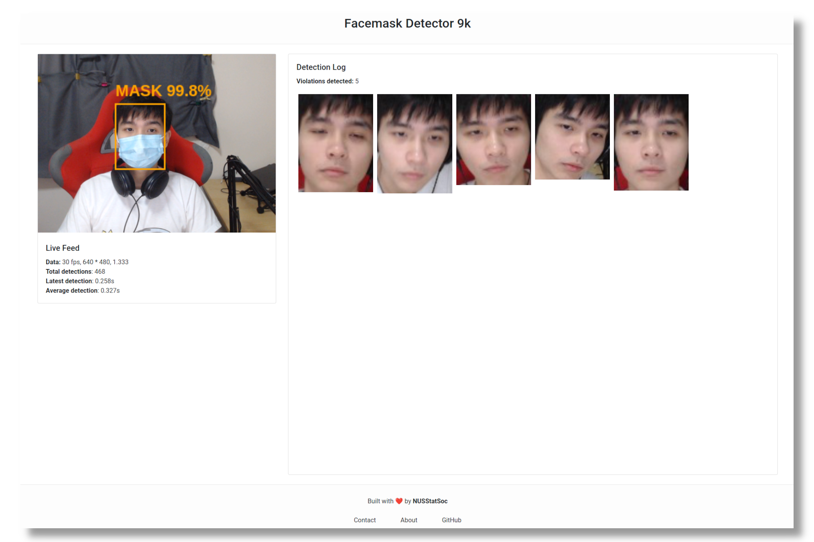

# Welcome to The NUS Statistics Society Facemask Detector Workshop!

The purpose of this repository is to **help you get started with the basic tools :hammer: and code :computer:** needed to follow along in the workshop. It will also serve as the single source of truth, hosting the latest version of our facemask :mask: detector workshop material :books:.

We hope that you will find great joy and meaning in our workshop! :joy: Consider giving this repository a star :star: if you found it helpful!



# Table of contents:

- [Pre-workshop installation guide](#pre-workshop-installation-guide)
  - [Windows](windows.md)
  - [Mac](mac.md)
  - [Linux](linux.md)
- [Project structure](#project-structure)
- [Project setup](#project-setup)
  - [Cloning this repo](#cloning-this-repo)
  - [Launching jupyter notebook](#launching-jupyter-notebook)
  - [Running the website](#running-the-frontend-website)
  - [Running the FastAPI server](#running-the-backend-fastapi-server)
- [Credits](#credits)

# Pre-workshop installation guide

This guide covers the installation of:

- Anaconda - a distribution of python which comes with a lot of data science packages :package:.
- `jupyter notebook` - a live python execution environment typically used for exploratory :mag: data analysis.
- `nodejs` and `npm` - nodejs is a js (javascript) runtime built on chrome's V8 engine :car: and npm is a package manager for nodejs.

You may find the detailed installation instructions for your operating system (Linux/Mac/Windows) via the links below. We know the instructions might look pretty lengthy but it won't take more than 20 minutes! :pray::pray::pray:

If you use a **Windows** machine, click [here](windows.md).

If you use a **Mac**, click [here](mac.md).

If you use **Linux**, click [here](linux.md).

Please only follow **ONE** of the installation guides e.g. if you're using Mac please don't follow the Linux guide by accident. We can't help you with troubleshooting issues otherwise.

## I have problem 😭😭. What do?

Please post a **[GitHub issue](https://github.com/geoboom/facemask-workshop/issues)** on this repo if you encounter any difficulties!

We'd love to help you, so do include as much information that could help us such as:

- error logs,
- your operating system (Windows/Mac/Linux),
- your `python3 --version`,
- the exact steps you took that led to the issue,
- etc.

Thank you :pray:

# Project structure

This is how the project is 🏘️🏗️structured🏢🏬. Do have a read to orient:angel: yourself.

## From the project root

```
.
├── backend/  <--- contains FastAPI server code
├── frontend/ <--- contains website server code (nextjs)
├── notebook/ <--- contains jupyter notebook code
├── linux.md
├── mac.md
├── README.md
└── windows.md
```

## Notebook

```
.
├── notebook/
    ├── data/ <--- contains our train and test data and labels
    │   ├── test/
    │   ├── test.csv
    │   ├── train/
    │   └── train.csv
    ├── facemask_workshop_participants.ipynb <--- the jupyter notebook you'll play with
    ├── history.pickle <--- our saved model training history
    └── model/         <--- our saved keras model (facemask detector)
        ├── assets/
        ├── saved_model.pb
        └── variables/
```

## Backend

```
.
├── backend/
    ├── detector/
    │   ├── config/
    │   │   ├── classifiers  <--- weights for non-DL face detector
    │   │   ├── facenet      <--- weights for DL face detector
    │   │   └── keras_model/ <--- our saved keras model (facemask detector)
    │   ├── detector.py      <--- our detector class that utilizes the model
    │   └── __init__.py
    ├── __init__.py
    ├── main.py          <--- FastAPI server entrypoint
    ├── requirements.txt <--- specifies the project dependencies
    └── run.sh           <--- simple script to help run the FastAPI server
```

## Frontend

```
.
├── frontend/
    ├── components/
    │   ├── cardDetectionLog/
    │   ├── cardVideoFeed/
    │   │   ├── Canvas.js        <--- draws bounding box around your face
    │   │   └── CardVideoFeed.js <--- video component
    │   └── footerContent/
    ├── config.js    <--- lets you configure the detection interval (fps)
    ├── package.json <--- specifies the project dependencies
    ├── pages/
    │   ├── _app.js
    │   └── index.js <--- website entrypoint
    ├── styles/
    └── utils/
        └── detector.js <--- contains functions to send API requests to backend
```

# Project setup

Follow the instructions below to get familiarized with the project repository. You may make reference to this section during the workshop itself to perform certain tasks :book:.

Note that the **backend code is incomplete** - you'll be filling in the blanks during the workshop!

## Cloning this repo

1. Open up terminal (wsl terminal for Windows) and type `sudo apt update && sudo apt upgrade`. This ensures you have the **latest system packages**.
2. Run `git clone --depth 1 https://github.com/geoboom/facemask-workshop.git` to **clone this repo**.
   - **Troubleshooting:** if you get a `git command not found` error, run `sudo apt install git` first then try cloning the repo again.
3. Run `ls` and you should see a folder called `facemask-workshop`.

## Launching `jupyter notebook`

1. In terminal, type `cd facemask-workshop` to navigate to the project's root folder.
1. In the root folder, navigate to the **notebook subdirectory** by typing `cd notebook`.
1. Type `conda activate base` to **activate Anaconda's base environment**. You should see `(base)` beside your name in terminal.
1. Now run `jupyter notebook` (`jupyter notebook --no-browser` if you're on windows) and this notebook folder should open in Jupyter Notebook on your browser.
   - If you're on windows, copy the url that looks like `http://127.0.0.1..token=..` OR `http://localhost..token=..`displayed in the terminal and paste it in your browser. This is the url to your Jupyter Notebook.
   - If for some reason Jupyter Notebook in the browser does not show the files in `notebook/` folder, then go back to terminal and hit CTRL+C to stop the server. Once the server has stopped, run `jupyter notebook --no-browser --notebook-dir=.`.

## Running the frontend (website)

1. **Open up a new terminal** and type `cd facemask-workshop` to navigate to the project's root folder.
1. In the root folder, navigate to the **frontend subdirectory** by typing `cd frontend`.
1. Type `npm install` to **install the frontend project dependencies** specified in `package.json`. This might take a while so grab a coffee :coffee:.
1. Once the dependencies have finished installing, type `npm run dev` to **run the website's server** (`nextjs`).
1. Visit `localhost:3000` in your browser to **see the website live!**

## Running the backend (FastAPI server)

1. **Open up a new terminal** and type `cd facemask-workshop` to navigate to the project's root folder.
1. In the root folder, navigate to the **backend subdirectory** by typing `cd backend`.
1. Type `python3 -m venv venv` to create a `python3` virtual environment in the backend directory.
   - **Troubleshooting:** if you get an error regarding `pip`/`ensurepip`/`venv`, you most likely do not have `python3-venv` installed. To resolve this, run `sudo apt install python3-venv`.
1. Type `source venv/bin/activate` to **activate this virtual environment**. You should see `(venv)` beside your name, indicating that the `venv` environment is activated.
1. Run `pip install -r requirements.txt` to **install the dependencies** to this virtual environment, specified by `requirements.txt`. This might take a while so grab a coffee :coffee:.
   - **Troubleshooting:** if you get "ERROR: Could not find a version that satisfies the requirement opencv-contrib-python=4.4.0.42..." attempting this step, fret not. Just run `git pull` to fetch the latest changes (I most likely updated the repo after you cloned it) and re-do step 5.
1. Once dependencies have finished installing, type `./run.sh` to **run the FastAPI** server and hit enter.

# Credits

This section is under construction.

| Name    | Role                                        | Github                      |
| ------- | ------------------------------------------- | --------------------------- |
| Jet     | NUS Statistics Society Workshop Director    | https://github.com/jetnew   |
| Rama    | Presenter, guide writing, and material prep | https://github.com/ramav111 |
| Georgie | Presenter, guide writing, and material prep | https://github.com/geoboom  |

[Dataset](https://github.com/prajnasb/observations/tree/master/experiements/dest_folder) for masked/no-masked.
